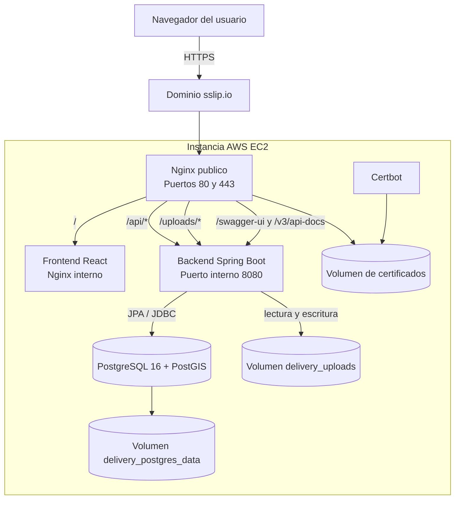
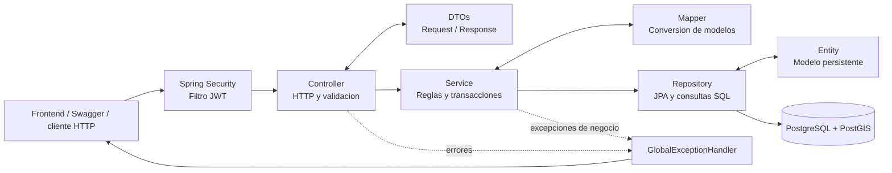
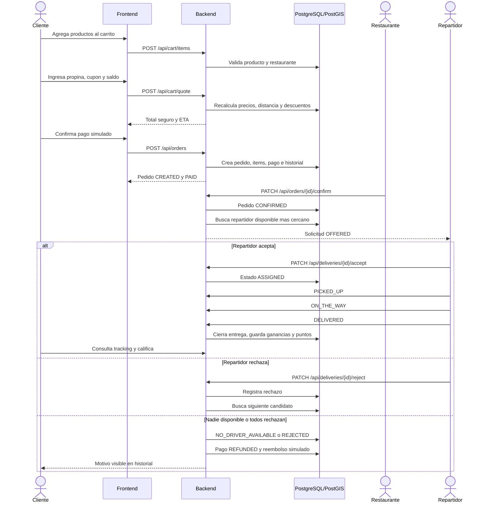
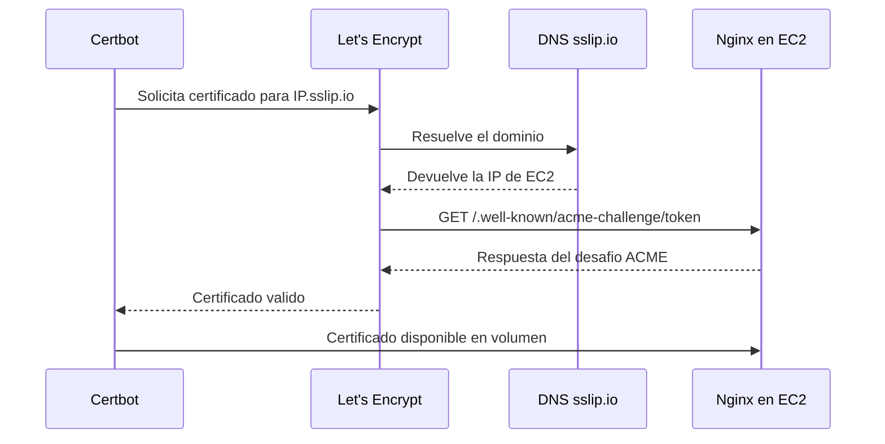
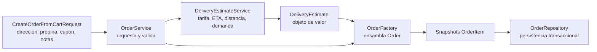

# Guia Tecnica Y De Exposicion Del Proyecto Delivery

## 1. Proposito Del Documento

Este documento explica como funciona la aplicacion Delivery en su version final,
como esta organizada, cuales son sus reglas de negocio principales y como puede
presentarse ante el catedratico.

La solucion permite coordinar cuatro actores:

| Actor | Responsabilidad principal |
| --- | --- |
| `CUSTOMER` | Buscar comida, gestionar carrito, pagar, seguir pedidos, reclamar y calificar |
| `RESTAURANT` | Gestionar restaurante, horarios, categorias, productos y pedidos |
| `DELIVERY` | Recibir solicitudes, aceptar entregas y avanzar su estado |
| `ADMIN` | Supervisar usuarios, restaurantes, reclamos, cupones, reportes y comisiones |

El pago actual es una simulacion de tarjeta. No se utiliza PayPal en la version
final.

## 2. Resumen Ejecutivo

La aplicacion esta formada por:

- Un frontend SPA desarrollado con React, TypeScript y Vite.
- Un backend REST desarrollado con Spring Boot.
- PostgreSQL con la extension PostGIS.
- Nginx como punto unico de entrada.
- Docker Compose para ejecutar todos los servicios.
- Certbot y Let's Encrypt para HTTPS.

El backend usa una arquitectura N-capas clasica. Las clases se organizan por su
responsabilidad tecnica:

```text
controller -> service -> repository -> database
```

Los datos que entran o salen de la API utilizan DTOs. Las entidades JPA no se
exponen directamente.

La version analizada contiene:

| Elemento | Cantidad |
| --- | ---: |
| Controladores | 16 |
| Servicios e implementaciones | 25 |
| Repositorios | 24 |
| Entidades y enumeraciones | 33 |
| DTOs | 68 |
| Tablas de negocio | 31 |
| Migraciones Flyway | 26 |

## 3. Diagrama General De Arquitectura



### Como leer el diagrama

1. El navegador solo conoce el dominio publico.
2. Nginx recibe toda solicitud HTTP/HTTPS.
3. Las rutas de interfaz se envian al frontend.
4. Las rutas `/api`, `/uploads` y Swagger se envian al backend.
5. El backend accede a PostgreSQL/PostGIS y al volumen de imagenes.
6. PostgreSQL, imagenes y certificados sobreviven aunque los contenedores sean
   recreados.

Los puertos `8080` y `5432` no se publican en Internet. La unica entrada publica
de la aplicacion es Nginx por `80/443`.

## 4. Arquitectura N-Capas Del Backend



### Capa Controller

Recibe solicitudes HTTP, valida los DTOs con Bean Validation, identifica el
metodo REST correcto y devuelve el codigo HTTP correspondiente.

Ejemplos:

- `AuthController`
- `RestaurantController`
- `CartController`
- `OrderController`
- `DeliveryController`
- `ComplaintController`
- `ReportController`

### Capa Service

Contiene la logica de negocio. Aqui se valida propiedad de recursos, estados,
horarios, montos, cupones, transiciones y permisos adicionales.

Las escrituras importantes usan `@Transactional`.

Ejemplos:

- `OrderService`
- `DeliveryService`
- `DeliveryEstimateService`
- `ImageStorageService`
- `LoyaltyService`
- `ComplaintService`
- `RestaurantCommissionService`

### Capa Repository

Usa Spring Data JPA para CRUD y consultas derivadas. Para operaciones espaciales
o consultas especiales usa SQL nativo y `JdbcTemplate`.

Ejemplos:

- `OrderRepository`
- `RestaurantRepository`
- `DeliveryAssignmentRepository`
- `ReportRepository`

### Capa Entity

Representa las tablas y relaciones persistentes. Los identificadores
transaccionales principales usan UUID v7. Esto evita depender de secuencias
globales para pedidos y mantiene identificadores ordenables en el tiempo.

### DTOs Y Mappers

Los DTOs separan el contrato HTTP de las entidades. Esto evita:

- Exponer contrasenas o campos internos.
- Serializar relaciones JPA accidentalmente.
- Acoplar el frontend al esquema fisico.
- Permitir que el cliente modifique campos calculados.

### Manejo De Errores

`GlobalExceptionHandler` transforma excepciones en respuestas JSON uniformes.

```json
{
  "status": 409,
  "error": "Conflict",
  "message": "Restaurant is currently closed",
  "path": "/api/orders",
  "details": []
}
```

Se utilizan, segun el caso:

- `400 Bad Request`
- `401 Unauthorized`
- `403 Forbidden`
- `404 Not Found`
- `409 Conflict`
- `500 Internal Server Error`

Los stack traces no se exponen al cliente.

## 5. Modulos Funcionales

Aunque el codigo esta organizado por capas y no por paquetes de dominio, la
aplicacion conserva los siguientes modulos funcionales.

### 5.1 Autenticacion Y Usuarios

Funciones:

- Registro de clientes.
- Login con correo y contrasena.
- Access token JWT.
- Refresh token persistente y revocable.
- Logout.
- Consulta y actualizacion del perfil.
- Activacion y desactivacion administrativa.
- Direcciones del cliente.

Seguridad:

- Contrasenas cifradas con BCrypt.
- Sesion stateless.
- JWT enviado en `Authorization: Bearer <token>`.
- Respuestas JSON para `401` y `403`.
- Proteccion tanto por ruta como por propiedad del recurso.

### 5.2 Restaurantes Y Horarios

Funciones:

- Crear y actualizar restaurante.
- Un usuario `RESTAURANT` solo puede poseer un restaurante.
- Desactivacion logica en lugar de borrado fisico.
- Reactivacion por administrador.
- Horario por cada dia de la semana.
- Indicador manual `is_open` combinado con el horario real.
- Busqueda por nombre, departamento o descripcion.
- Busqueda de restaurantes cercanos.

Un pedido solo puede crearse si:

1. El restaurante esta activo.
2. El indicador de apertura esta habilitado.
3. Existe horario para el dia actual.
4. La hora actual se encuentra entre apertura y cierre.

### 5.3 Categorias, Productos Y Promociones

Funciones:

- CRUD de categorias.
- CRUD de productos.
- Precio y disponibilidad.
- Imagen de producto.
- Promociones por porcentaje y vigencia.
- Productos agrupados por categoria en frontend.

La FK compuesta de productos asegura que la categoria y el producto pertenezcan
al mismo restaurante.

### 5.4 Carrito

Funciones:

- Crear carrito activo.
- Agregar productos.
- Modificar cantidades.
- Eliminar productos.
- Vaciar carrito.
- Calcular subtotal.
- Impedir mezclar restaurantes en un mismo carrito activo.
- Cotizar de forma segura antes de pagar.

`POST /api/cart/quote` recalcula en backend:

- Subtotal.
- Costo de envio.
- Propina.
- Cupon.
- Saldo digital.
- Total final.
- Distancia y tiempo estimado.

El frontend nunca es la fuente confiable de precios.

### 5.5 Pedidos Y Pago Simulado

Al confirmar el checkout:

1. El backend vuelve a leer el carrito.
2. Verifica que no este vacio.
3. Verifica que el restaurante este abierto.
4. Verifica que la direccion pertenezca al cliente.
5. Recalcula subtotal, envio, propina y descuentos.
6. Crea snapshots de nombre y precio para cada item.
7. Registra el pedido.
8. Registra un pago simulado con estado `PAID`.
9. Marca el carrito como `CHECKED_OUT`.
10. Registra historial de estado.

El impuesto se mantiene en cero. Los restaurantes consideran sus obligaciones
tributarias al definir el precio del producto.

`OrderFactory` centraliza la construccion del pedido para evitar setters
dispersos en el flujo y facilitar nuevos atributos.

### 5.6 Delivery

La asignacion manual esta deshabilitada para el flujo normal.

Cuando el restaurante confirma:

1. El pedido cambia de `CREATED` a `CONFIRMED`.
2. El backend busca un repartidor activo y disponible.
3. Si hay ubicaciones, selecciona el mas cercano con PostGIS.
4. Si no hay suficientes coordenadas, usa un candidato disponible por orden de
   antiguedad.
5. Crea una solicitud `OFFERED`.
6. El repartidor puede aceptar o rechazar.
7. Un rechazo queda registrado para no ofrecer de nuevo el mismo pedido al
   mismo repartidor.
8. Si existe otro candidato, la solicitud se reasigna.
9. Si todos rechazan, el pedido queda `REJECTED` y se registra un reembolso
   simulado.

Transiciones de una entrega aceptada:

```text
ASSIGNED -> PICKED_UP -> ON_THE_WAY -> DELIVERED
```

La interfaz del repartidor presenta una sola accion siguiente para simplificar
el uso.

Al entregar:

- El pedido cambia a `DELIVERED`.
- Se calculan ganancias del repartidor.
- Se acumulan puntos de fidelidad al cliente.
- Se habilitan calificaciones y reclamos.

### 5.7 Seguimiento

El seguimiento se realiza mediante REST:

```http
GET /api/orders/{id}/tracking
```

Devuelve:

- Estado del pedido.
- Estado de delivery.
- Restaurante.
- Repartidor asignado.
- Direccion en texto plano.
- ETA.
- Distancia.
- Pago y reembolso.
- Historial de estados.

No se usan WebSockets. El frontend puede refrescar o consultar periodicamente.
Esto cumple el alcance acordado sin introducir infraestructura innecesaria.

### 5.8 Reclamos Y Reembolsos

Reglas:

- Solo el cliente propietario puede reclamar.
- El pedido debe estar entregado.
- Solo existe un reclamo por pedido.
- El flujo es `OPEN -> IN_PROGRESS -> RESOLVED/REJECTED`.
- Solo el administrador resuelve.
- El administrador elige sin reembolso, reembolso parcial o total.
- El comentario administrativo se guarda como resolucion.

El reembolso aprobado se acredita al monedero digital del cliente para utilizarse
en compras futuras.

### 5.9 Cupones

Solo el administrador crea cupones.

Tipos:

- `PERCENTAGE`
- `FIXED`

Validaciones:

- Vigencia.
- Estado activo.
- Monto minimo.
- Limite de usos.
- Descuento maximo.
- El descuento nunca supera el subtotal.

Los cupones son financiados por la plataforma:

- Reducen lo que paga el cliente.
- No reducen el ingreso bruto del restaurante.
- No reducen la tarifa ni propina del repartidor.

### 5.10 Fidelidad Y Monedero Digital

Cuando un pedido se entrega, el cliente recibe puntos equivalentes a la parte
entera del total.

```text
1 punto = $0.01 de credito
```

Los puntos pueden convertirse en credito. El balance digital combina:

- Credito obtenido al canjear puntos.
- Reembolsos aprobados.

En checkout el cliente puede aplicar el saldo disponible. El calculo y consumo
del saldo se realizan dentro de una transaccion en backend.

### 5.11 Calificaciones

Un cliente puede calificar despues de recibir el pedido:

- Restaurante.
- Repartidor asignado.
- Cada producto realmente comprado.

Reglas:

- Pedido `DELIVERED`.
- Escala de 1 a 5.
- Solo el propietario del pedido.
- No se permite duplicar una calificacion equivalente.
- No se puede calificar un producto que no estaba en el pedido.

### 5.12 Reportes Y Administracion

Reportes:

- Restaurantes mas pedidos.
- Productos mas vendidos.
- Pedidos por estado.
- Reclamos por estado.
- Usuarios por rol.
- Repartidores destacados.
- Resumen administrativo.
- Ingreso bruto y neto por restaurante.
- Comisiones generadas.

Administracion:

- Buscar usuarios.
- Activar o desactivar usuarios.
- Reactivar restaurantes.
- Resolver reclamos.
- Crear y gestionar cupones.
- Configurar comisiones globales.

## 6. Flujo Completo De Un Pedido



## 7. Geolocalizacion Y PostGIS

### Datos almacenados

Se usa el tipo:

```sql
GEOGRAPHY(Point, 4326)
```

en:

- Direcciones de clientes.
- Restaurantes.
- Historial de ubicaciones de repartidores.

SRID `4326` representa coordenadas GPS WGS84.

### Captura en frontend

Direcciones y restaurantes usan Leaflet con mapas de OpenStreetMap. El usuario
coloca o arrastra un pin.

El repartidor no selecciona manualmente su punto. El navegador usa:

```text
navigator.geolocation.getCurrentPosition
```

con alta precision. La ubicacion se sincroniza al iniciar o restaurar sesion y
al actualizar su perfil.

Las coordenadas se normalizan a seis decimales. Esa precision representa
aproximadamente decimetros, aunque la precision real depende del dispositivo,
GPS, Wi-Fi y permisos del navegador.

La geolocalizacion del navegador requiere HTTPS, por eso se implemento Certbot.

### Consultas espaciales

`ST_DWithin`:

- Busca restaurantes dentro de un radio.

`ST_Distance`:

- Calcula distancia restaurante-direccion.
- Ordena repartidores por cercania al restaurante.

Los indices GiST aceleran consultas espaciales.

### Calculo del envio

La tarifa usa tramos estables:

| Distancia | Precio por km |
| --- | ---: |
| Primeros 3 km | `$0.35` |
| De 3 a 6 km | `$0.45` |
| De 6 a 10 km | `$0.55` |
| Mas de 10 km | `$0.65` |

Se agrega una base de `$1.10`.

En horario pico el backend multiplica la tarifa por `1.10`. Si no hay datos
geograficos suficientes se usa un fallback de `4 km`.

ETA:

```text
20 minutos base
+ 4 minutos por kilometro
+ 2 minutos por item adicional
+ 8 minutos en horario pico
```

### Alcance geoespacial

La aplicacion no implementa:

- Navegacion GPS.
- Trazado de rutas.
- Mapas en tiempo real.
- WebSockets.

PostGIS se usa para distancia, cercania y seleccion, no como sistema de
navegacion.

### Punto Alinear

El backend considera pico aproximadamente de `11:30-13:30` y `18:00-20:30`.
El banner informativo del frontend usa una ventana distinta. La tarifa siempre
se decide en backend, pero ambas ventanas deberian alinearse en una mejora
posterior para evitar mensajes inconsistentes.

## 8. Gestion De Imagenes

### Flujo

1. Restaurante o administrador envia `multipart/form-data`.
2. El backend valida extension y MIME.
3. `ImageIO` intenta decodificar el contenido real.
4. La imagen se convierte a RGB, eliminando metadatos durante la recodificacion.
5. Se redimensiona si excede el ancho permitido.
6. Se intenta guardar como WebP.
7. Si el runtime no tiene escritor WebP, se guarda como JPEG.
8. La base de datos conserva solo la URL relativa.

Limites:

| Tipo | Ancho maximo |
| --- | ---: |
| Restaurante | 1280 px |
| Producto | 800 px |

Configuracion:

```text
Tamano maximo de entrada: 10 MB
Calidad: 0.82
Formatos aceptados: JPG, JPEG, PNG, WEBP
```

### Ubicacion

Dentro del contenedor:

```text
/app/uploads/
|-- restaurants/
|   `-- restaurant-{uuid}.webp o .jpg
`-- products/
    `-- product-{uuid}.webp o .jpg
```

En Docker se monta:

```text
delivery_uploads -> /app/uploads
```

La base guarda rutas como:

```text
/uploads/restaurants/restaurant-{uuid}.webp
/uploads/products/product-{uuid}.webp
```

Spring sirve `/uploads/**` desde el filesystem y Nginx redirige esa ruta al
backend.

### Ventaja

No se guardan BLOBs en PostgreSQL. Esto mantiene la base ligera y permite que
Nginx/browser manejen archivos de forma normal.

### Limitacion

El almacenamiento esta ligado a la instancia mediante un volumen Docker. Es
correcto para el despliegue academico actual. En una arquitectura horizontal se
deberia migrar a almacenamiento compartido como S3.

## 9. Seguridad Y Autorizacion

### Login

1. Se valida correo y contrasena.
2. BCrypt compara el hash.
3. Se genera JWT de acceso.
4. Se genera refresh token.
5. El frontend guarda la sesion y consulta `/api/auth/me`.

### Roles

| Rol | Ejemplos de permisos |
| --- | --- |
| `ADMIN` | Reportes, cupones, comisiones, reclamos y usuarios |
| `CUSTOMER` | Carrito, pedidos, direcciones, fidelidad y reviews |
| `RESTAURANT` | Su restaurante, menu, horarios y pedidos propios |
| `DELIVERY` | Sus solicitudes, entregas, ubicacion y estadisticas |

### Autorizacion doble

La primera validacion ocurre en Spring Security por URL y rol.

La segunda ocurre en servicios:

- El cliente solo ve sus pedidos.
- El restaurante solo modifica su negocio.
- El repartidor solo cambia sus asignaciones.
- El cliente solo reclama/califica pedidos propios.

Esto evita IDOR: conocer un UUID no otorga acceso.

## 10. Base De Datos

Tecnologias:

- PostgreSQL 16.
- PostGIS 3.4.
- Flyway.
- Hibernate/JPA.
- HikariCP.

Flyway crea y evoluciona el esquema. Hibernate usa:

```yaml
ddl-auto: validate
```

Por tanto Hibernate no improvisa tablas; solo verifica que las entidades sean
compatibles con el esquema versionado.

La base contiene 31 tablas funcionales. Su estructura final se obtiene de las
26 migraciones ubicadas en `src/main/resources/db/migration/`.

Decisiones importantes:

- UUID v7 para identificadores transaccionales.
- FK y restricciones unicas.
- Checks para estados y montos.
- Indices para consultas frecuentes.
- Indices GiST para ubicaciones.
- Soft delete mediante `is_active` donde corresponde.
- Snapshots de items, comisiones y ganancias para conservar historia.

## 11. Dinero, Cupones Y Comisiones

### Cliente

Paga:

```text
subtotal + envio + propina - cupon - credito digital
```

El impuesto actual es cero.

### Restaurante

El ingreso bruto se basa en el subtotal de productos, no en el envio.

```text
neto restaurante = subtotal - comision de plataforma
```

El cupon no reduce su liquidacion porque lo financia la plataforma.

La comision aplicable se busca usando la fecha de creacion del pedido. Si el
administrador cambia el porcentaje, los pedidos anteriores conservan el
porcentaje vigente cuando fueron creados.

### Repartidor

```text
bruto = tarifa de envio + propina
comision = tarifa de envio * porcentaje
neto = bruto - comision
```

La propina no paga comision.

Al entregar se guarda un snapshot de bruto, porcentaje, comision y neto. Los
cambios futuros no alteran pedidos historicos.

## 12. Frontend

El frontend usa:

- React.
- TypeScript.
- Vite.
- React Router.
- CSS responsive propio.
- Cliente HTTP centralizado.
- Leaflet y OpenStreetMap para seleccion de puntos.

Rutas protegidas:

```text
/cliente/*
/restaurante/*
/repartidor/*
/admin/*
```

`RequireRole` impide renderizar una seccion de otro rol. Esta proteccion mejora
UX, pero la seguridad real siempre se mantiene en backend.

La aplicacion es responsive:

- Sidebar en escritorio.
- Navegacion compacta en movil.
- Formularios, tarjetas y tablas adaptables.
- Estados de carga, error, vacio y exito.

## 13. Nginx, Docker Y HTTPS

### Servicios Docker

| Servicio | Funcion |
| --- | --- |
| `db` | PostgreSQL + PostGIS |
| `backend` | API Spring Boot |
| `frontend` | Build React servido por Nginx interno |
| `nginx` | Proxy inverso publico |
| `certbot` | Emision y renovacion de certificados |

Todos usan:

```yaml
restart: unless-stopped
```

### Enrutamiento De Nginx

| Ruta | Destino |
| --- | --- |
| `/` | Frontend |
| `/api/*` | Backend |
| `/uploads/*` | Backend/archivos |
| `/swagger-ui/*` | Backend |
| `/v3/api-docs` | Backend |

Nginx tambien:

- Redirige HTTP a HTTPS.
- Envia encabezados `X-Forwarded-*`.
- Limita cargas a 10 MB.
- Mantiene frontend y backend bajo el mismo origen.

Usar el mismo origen reduce problemas de CORS.

### HTTPS

#### Por que se uso sslip.io

La instancia originalmente solo tenia una IP publica y no un dominio comprado.
`sslip.io` ofrece DNS basado en IP. Por ejemplo:

```text
34.201.111.152.sslip.io -> 34.201.111.152
```

El navegador consulta DNS y obtiene la IP incluida en el nombre. `sslip.io` no
transporta ni inspecciona el trafico de la aplicacion; solo resuelve el nombre.
La conexion HTTPS sigue viajando directamente entre el navegador y la instancia
EC2.

Se necesitaba un nombre DNS para que Certbot pudiera solicitar de forma sencilla
un certificado de Let's Encrypt para el despliegue. El proceso es:



Ventajas para el proyecto academico:

- No requiere comprar ni configurar un dominio.
- Permite emitir un certificado TLS confiable.
- Facilita probar la aplicacion desde otros dispositivos.
- Habilita la API de geolocalizacion del navegador, que exige un contexto
  seguro.
- Permite demostrar Nginx, HTTPS y renovacion de certificados.

HTTPS es importante para:

- Proteger JWT y datos.
- Evitar contenido inseguro.
- Habilitar geolocalizacion del navegador.

Limitaciones:

- Si cambia la IP publica, cambia el dominio `sslip.io`.
- Debe emitirse un certificado nuevo para el nuevo nombre.
- No ofrece un nombre comercial o institucional.
- Depende de un servicio DNS externo.

Para un despliegue de produccion se recomienda una Elastic IP y un dominio
propio. `sslip.io` es una solucion practica para laboratorio, demostracion y
produccion academica de bajo riesgo.

### Persistencia

| Volumen | Contenido |
| --- | --- |
| `delivery_postgres_data` | Base de datos |
| `delivery_uploads` | Imagenes |
| `certbot_etc` | Certificados |
| `certbot_www` | Desafio ACME |

No se debe ejecutar `docker compose down -v` salvo que se quiera eliminar todos
los datos.

La guia operativa completa esta en:

- [DEPLOYMENT_SETUP_GUIDE.md](DEPLOYMENT_SETUP_GUIDE.md)
- [DEPLOYMENT_HANDOFF_GUIDE.md](DEPLOYMENT_HANDOFF_GUIDE.md)

## 14. Calidad, Consistencia Y Escalabilidad

### 14.1 El Reto Planteado

La creacion de un pedido combina:

- Cliente.
- Restaurante.
- Direccion.
- Items.
- Precios historicos.
- Cupon.
- Propina.
- Costo de envio.
- Impuestos.
- Credito de fidelidad.
- Monedero digital.
- Distancia.
- ETA.
- Demanda.
- Pago.
- Historial.

El problema tiene dos dimensiones diferentes:

1. **Flexibilidad del objeto:** evitar constructores extensos y setters
   repartidos por controladores y servicios.
2. **Volumen:** procesar hasta `10 000 pedidos/minuto`, aproximadamente
   `166.7 pedidos/segundo`, sin duplicar datos ni perder consistencia.

Un Builder o Factory mejora la primera dimension. El rendimiento de la segunda
depende principalmente de base de datos, concurrencia, I/O, infraestructura y
mediciones.

### 14.2 Patron Seleccionado: Factory + DTOs + Objetos De Valor

El proyecto utiliza `OrderFactory` como punto unico para ensamblar la entidad
`Order`.



Responsabilidades:

| Componente | Responsabilidad |
| --- | --- |
| `CreateOrderFromCartRequest` | Recibe solo opciones permitidas al cliente |
| `OrderService` | Valida y calcula reglas; no confia en totales del frontend |
| `DeliveryEstimate` | Agrupa tarifa, ETA, distancia, pico y multiplicador |
| `OrderFactory` | Construye el pedido de manera uniforme |
| `OrderItem` | Conserva snapshot de nombre, cantidad y precio |
| `OrderRepository` | Persiste dentro de la transaccion |

No se eligio un Builder fluido adicional porque:

- La entidad JPA ya requiere constructor sin argumentos.
- El servicio debe calcular primero todos los valores confiables.
- La creacion tiene un unico flujo principal desde carrito.
- La Factory centraliza el armado sin exponer setters al controller.
- Agregar otro patron sobre la Factory no aportaba suficiente beneficio para la
  version actual.

La firma de `OrderFactory.fromCart` aun recibe varios valores calculados. Es
mejor que tener la construccion duplicada, pero una evolucion posible seria
agruparlos en un `OrderCreationContext` si aparecen mas variantes de creacion.
Esta observacion demuestra que se aplico el patron con criterio y no solo por
cumplir.

### 14.3 Como Se Evitan Errores En La Construccion

#### El frontend no envia totales

El cliente envia identificadores y opciones. El backend vuelve a obtener:

- Productos.
- Cantidades.
- Precios.
- Direccion.
- Cupon.
- Balance digital.

Esto impide alterar el total desde las herramientas del navegador.

#### Snapshot de items

Cada `OrderItem` guarda nombre y precio al comprar. Si el restaurante cambia el
producto despues, el pedido historico no cambia.

#### Valores opcionales normalizados

- Propina ausente se convierte en cero.
- Cupon ausente no genera descuento.
- Impuesto actual se fija en cero.
- Distancia ausente usa fallback.
- Credito solo se descuenta si fue solicitado y existe balance.

#### Una transaccion de negocio

`createFromCart` usa `@Transactional`. En una misma unidad se crean o actualizan:

- Pedido.
- Items.
- Historial.
- Redencion de cupon.
- Pago simulado.
- Puntos o credito.
- Estado del carrito.

Si una operacion falla, Spring revierte la transaccion y evita pedidos
parcialmente creados.

### 14.4 Elementos Que Ayudan Al Rendimiento

- Backend stateless con JWT.
- UUID v7 para evitar depender de una secuencia central en entidades de alto
  volumen y mantener orden temporal aproximado.
- HikariCP para reutilizar conexiones.
- Indices en cliente, restaurante, estado y fecha de pedidos.
- Indices GiST para consultas PostGIS.
- Paginacion en historiales y listados.
- Consultas especificas en repositorios.
- Restricciones unicas que impiden redenciones o items duplicados.
- Locks pesimistas al confirmar o cambiar estados.
- `FOR UPDATE SKIP LOCKED` para seleccionar repartidores concurrentemente.
- Operaciones de escritura delimitadas con `@Transactional`.
- Contenedores independientes para frontend, backend y base.

### 14.5 Que Significa SKIP LOCKED

Si dos procesos intentan asignar repartidores al mismo tiempo, PostgreSQL
bloquea la fila elegida por el primero. El segundo no queda esperando esa misma
fila: la omite y busca otro candidato. Esto reduce contencion y evita dobles
asignaciones.

`SKIP LOCKED` no acelera por si mismo la creacion del pedido, pero protege el
paso concurrente posterior de asignacion.

### 14.6 Separacion Del Camino Critico

El camino critico de checkout solo realiza operaciones necesarias para devolver
una compra consistente:

```text
validar -> calcular -> crear pedido/items -> pago simulado -> cerrar carrito
```

La confirmacion del restaurante y la operacion del repartidor ocurren despues.
No se intenta completar toda la entrega durante la solicitud de compra.

En la version actual los reintentos iniciales de asignacion se ejecutan de forma
sincrona al confirmar. Para cargas muy altas convendria moverlos a una cola.

### 14.7 Que Falta Para Garantizar 10 000 Pedidos/Minuto

La aplicacion actual funciona en una sola instancia. No existe evidencia de una
prueba real de `10 000 pedidos/minuto`.

Para certificar ese volumen se necesita:

- Ejecutar pruebas con k6, Gatling o JMeter.
- Definir p95/p99 de latencia y tasa maxima de errores.
- Agregar idempotencia al endpoint de checkout.
- Ejecutar varias instancias del backend detras de un balanceador.
- Usar PostgreSQL/RDS dimensionado y ajustar Hikari.
- Revisar planes de ejecucion e indices con datos realistas.
- Mover asignacion/reintentos y notificaciones a una cola asincrona.
- Usar cache para catalogo y lecturas frecuentes.
- Mover imagenes a almacenamiento compartido.
- Agregar metricas, tracing y alertas.

La arquitectura de codigo facilita evolucionar, pero no debe afirmarse que el
despliegue actual ya soporta ese volumen sin mediciones.

### 14.8 Prueba Real De Carga Ejecutada

Para verificar el comportamiento real se ejecuto una prueba de estres contra la
instancia EC2 en:

```text
https://54.91.92.160.sslip.io/login
```

Metodologia aplicada:

1. Se confirmo que el backend, frontend, Nginx y PostgreSQL estuvieran arriba.
2. Se sembraron `1000` usuarios de carga y `1000` direcciones asociadas.
3. Se generaron `1000` JWT validos para evitar que el costo de login afectara la medicion.
4. Se valido que el restaurante de prueba estuviera abierto mediante horario completo.
5. Se ejecuto `k6` con `constant-arrival-rate` a `167 iteraciones/s` durante `1m`.
6. Cada iteracion realizo el flujo real de carrito + creacion de orden usando la API.
7. Al finalizar, se limpiaron los datos temporales y se elimino el horario de prueba.

Resultado obtenido:

| Indicador | Valor |
| --- | ---: |
| Objetivo nominal | `10,000 pedidos/minuto` |
| Pedidos exitosos | `10,018` |
| Tasa de exito | `100%` |
| Iteraciones perdidas | `3` |
| Duracion promedio de creacion | `255.13 ms` |
| p95 de creacion de orden | `990.14 ms` |
| `http_req_failed` | `0%` |
| `http_req_duration` promedio | `248.65 ms` |
| `http_req_duration` p95 | `961.93 ms` |

Conclusiones de la corrida:

- La prueba demostro que el flujo de pedidos si puede sostener el volumen
  objetivo en la instancia actual mejorada.
- El restaurante estaba inicialmente bloqueado por horario, por eso primero se
  habilito temporalmente un horario abierto en toda la semana.
- El cuello no estuvo en memoria, sino en la carga del backend bajo alta
  concurrencia.
- Al terminar, la base de datos quedo limpia y sin datos de prueba residuales.

### 14.9 Respuesta Corta Para La Exposicion

> Resolvimos la complejidad de construccion con DTOs, un servicio orquestador,
> un objeto de estimacion y una Factory que centraliza el ensamblaje. Para
> consistencia usamos transacciones, snapshots, restricciones y locks. Para
> rendimiento usamos UUID v7, indices, paginacion y pool de conexiones. En la
> prueba real de carga el sistema completo sostuvo `10,018` pedidos exitosos en
> un minuto, con `p95` por debajo de `1s`, lo que confirma que la base tecnica
> y la infraestructura actual ya responden a ese objetivo de laboratorio.

## 15. Swagger Y Documentacion API

Swagger se organiza en grupos:

1. Todos los endpoints.
2. Auth y usuarios.
3. Catalogo.
4. Carrito y pedidos.
5. Delivery, reclamos y reviews.
6. Admin, cupones, fidelidad y reportes.

Flujo para probar:

1. Ejecutar `POST /api/auth/login`.
2. Copiar `accessToken`.
3. Pulsar `Authorize`.
4. Escribir `Bearer <token>`.
5. Probar endpoints del rol.

## 16. Como Explicarlo Ante El Catedratico

### Apertura sugerida

> Delivery es una plataforma de pedidos de comida con cuatro roles. La
> construimos como una SPA React que consume una API REST Spring Boot. El
> backend usa arquitectura N-capas y PostgreSQL con PostGIS. La aplicacion esta
> dockerizada y expuesta por Nginx con HTTPS.

### Orden recomendado para una presentacion de 12 minutos

| Tiempo | Tema |
| --- | --- |
| 1 minuto | Problema, actores y alcance |
| 2 minutos | Diagrama general y arquitectura N-capas |
| 4 minutos | Demostracion del pedido por roles |
| 2 minutos | PostGIS, imagenes y reglas financieras |
| 1 minuto | Seguridad y manejo de errores |
| 1 minuto | Docker, Nginx, HTTPS y persistencia |
| 1 minuto | Escalabilidad, limites y cierre |

### Demostracion recomendada

1. Iniciar sesion como cliente.
2. Mostrar restaurantes cercanos.
3. Abrir un menu agrupado por categorias.
4. Agregar productos.
5. Mostrar cotizacion, envio, propina y cupon.
6. Crear el pedido.
7. Iniciar sesion como restaurante.
8. Confirmar el pedido.
9. Iniciar sesion como repartidor.
10. Aceptar solicitud y avanzar hasta `DELIVERED`.
11. Volver al cliente para tracking, factura y calificaciones.
12. Mostrar administrador: reportes, comisiones y reclamos.
13. Abrir Swagger.
14. Mostrar las migraciones y el esquema de tablas.

### Puntos que conviene enfatizar

- Los precios se recalculan en backend.
- Un restaurante cerrado no recibe pedidos.
- La asignacion usa repartidores activos, disponibles y no rechazados.
- PostGIS trabaja en metros sobre `GEOGRAPHY`, no con una formula plana.
- Los cupones los financia la plataforma.
- La propina queda libre de comision.
- Las comisiones historicas no cambian retroactivamente.
- Las imagenes no se guardan como BLOB.
- El tracking funciona por REST, como exige el alcance.
- La base y las imagenes persisten en volumenes.
- `sslip.io` proporciona resolucion DNS; el trafico llega directamente a EC2.
- Factory y transacciones resuelven problemas distintos dentro de escalabilidad.

## 17. Preguntas Probables Y Respuestas

### Por que arquitectura N-capas?

Porque separa transporte HTTP, negocio, persistencia y modelo. Permite probar
servicios sin depender de controladores y cambiar persistencia sin reescribir la
interfaz.

### Por que DTOs y no entidades?

Para proteger campos internos, controlar el contrato, validar entrada y evitar
problemas de serializacion JPA.

### Por que PostgreSQL con PostGIS?

Porque la distancia y cercania son consultas espaciales. PostGIS proporciona
tipos, indices y funciones correctas para coordenadas geograficas.

### Por que JWT?

Porque la API es stateless, se integra bien con una SPA y permite autorizacion
por rol sin mantener sesiones HTTP en memoria.

### Por que sslip.io?

Porque la instancia tenia una IP publica pero no un dominio. `sslip.io` convierte
un nombre que contiene la IP en un registro DNS utilizable por Certbot. Esto
permitio obtener HTTPS de Let's Encrypt sin comprar dominio y habilitar la
geolocalizacion del navegador. No actua como proxy: el trafico llega directamente
a EC2. Si cambia la IP hay que cambiar el dominio y renovar el certificado.

### Por que no WebSockets?

El requisito acepta polling. REST simplifica infraestructura y es suficiente
para el ritmo de actualizacion del proyecto.

### Donde se guardan las imagenes?

En `/app/uploads` dentro de un volumen Docker persistente. La base solo guarda
la ruta relativa.

### Que pasa si se cambia una comision?

Los pedidos historicos conservan el porcentaje de su fecha o el snapshot
registrado. El cambio aplica a operaciones posteriores.

### Que pasa si no hay repartidor?

Se reintenta asignacion. Si no existe candidato, el pedido queda
`NO_DRIVER_AVAILABLE` y se simula el reembolso. Si todos rechazan queda
`REJECTED`, tambien con reembolso simulado.

### Como se evita que un repartidor reciba una propuesta estando inactivo?

La consulta exige usuario activo, rol `DELIVERY` y perfil disponible.

### Soporta 10 000 pedidos por minuto?

La estructura evita constructores extensos, usa transacciones, indices, locks y
pool de conexiones. Sin embargo, esa cifra requiere pruebas de carga e
infraestructura distribuida. La respuesta correcta es que el codigo esta
preparado para evolucionar, pero el despliegue academico de una sola EC2 no ha
sido certificado para ese volumen.

## 18. Checklist Antes De Presentar

- Confirmar que los cinco contenedores estan levantados.
- Confirmar HTTPS sin advertencias.
- Confirmar login de los cuatro roles.
- Tener un restaurante abierto segun horario.
- Tener al menos un repartidor activo, disponible y con ubicacion.
- Tener una direccion de cliente.
- Tener productos disponibles.
- Preparar un cupon vigente.
- Limpiar carritos/pedidos de pruebas que puedan confundir.
- Abrir Swagger en otra pestana.
- Abrir este documento y las migraciones principales.
- Probar el flujo una vez antes de iniciar.

## 19. Archivos Clave Para Mostrar

| Tema | Archivo |
| --- | --- |
| Entrada de Spring Boot | `DeliveryBackendApplication.java` |
| Seguridad | `security/SecurityConfig.java` |
| Flujo de pedido | `service/OrderService.java` |
| Construccion de pedido | `service/OrderFactory.java` |
| Asignacion delivery | `service/DeliveryService.java` |
| Tarifa y ETA | `service/DeliveryEstimateService.java` |
| Consultas PostGIS | `repository/RestaurantRepository.java` |
| Imagenes | `service/ImageStorageService.java` |
| Errores | `exception/GlobalExceptionHandler.java` |
| Migraciones | `src/main/resources/db/migration/` |
| Docker Compose | `docker-compose.aws.yml` |
| Nginx | `deploy/nginx/default.conf` |
| Esquema de base | `src/main/resources/db/migration/` |

## 20. Cierre Sugerido

> La fortaleza principal del proyecto no es solo que completa el flujo de una
> entrega. Tambien conserva reglas de propiedad, estados, historial financiero,
> ubicaciones espaciales y persistencia. La arquitectura N-capas mantiene esas
> responsabilidades separadas, mientras Docker y Nginx permiten ejecutar la
> solucion completa de manera reproducible.
