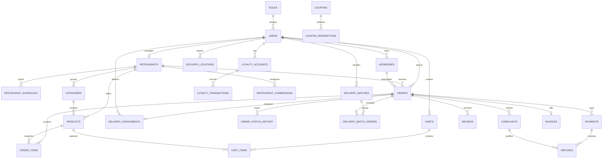

# Delivery Backend

Backend para una plataforma de delivery de comida donde restaurantes publican productos, clientes realizan pedidos y repartidores reciben asignaciones segun cercania. El proyecto esta construido con Spring Boot, PostgreSQL/PostGIS, Flyway y una API REST documentable con OpenAPI.

> Estado actual: el repositorio contiene la base del modelo de negocio, migraciones completas para la base de datos y el modulo de asignacion/seguimiento de repartidores. La autenticacion real todavia esta en modo desarrollo: Spring Security permite las peticiones y `AuthenticatedUserProvider` resuelve el usuario actual desde `X-Dev-User-Id` o desde `DEV_DELIVERY_USER_ID`.

## Objetivo del Proyecto

El sistema responde a la tematica **Servicio de Delivery de Comida**:

- restaurantes administran menus, precios y horarios;
- usuarios compran comida para entrega a domicilio;
- repartidores reciben pedidos y actualizan el estado de la entrega;
- administradores gestionan usuarios, reclamos y comisiones.

Tambien se dejo preparada la estructura de datos para cupones, fidelidad, facturacion, reclamos, reembolsos, agrupacion de pedidos y pagos simulados/Stripe.

## Tecnologias

- Java 25
- Spring Boot 4.0.6
- Spring Web MVC
- Spring Data JPA / Hibernate
- Spring Security
- Bean Validation
- PostgreSQL con PostGIS
- Flyway
- Springdoc OpenAPI
- Maven Wrapper
- JUnit 5, Mockito, MockMvc

## Arquitectura

El proyecto sigue una arquitectura por modulos de dominio:

```text
src/main/java/sv/edu/uca/delivery/backend
├── address       # direcciones de usuarios
├── auth          # roles
├── common        # manejo global de errores
├── delivery      # asignacion y ciclo de vida de entregas
├── order         # pedidos
├── restaurant    # restaurantes
├── security      # usuario autenticado/configuracion de seguridad
├── user          # usuarios
└── util          # generador UUID v7
```

Capas usadas en el modulo `delivery`:

- `controller`: expone endpoints REST.
- `dto`: define contratos de entrada/salida.
- `service`: concentra reglas de negocio y transacciones.
- `repository`: consultas JPA y geoespaciales.
- `entity`: mapeo de tablas.
- `exception`: errores de negocio con codigos HTTP.
- `mapper`: conversion de entidades a respuestas.

## Reglas de Negocio Implementadas

Actualmente el backend implementa el nucleo de delivery:

- asignacion automatica de un repartidor activo con rol `DELIVERY`;
- busqueda del repartidor disponible mas cercano al restaurante usando PostGIS;
- bloqueo pesimista de pedidos/asignaciones para evitar carreras en alta concurrencia;
- validacion de pedidos cancelados o entregados antes de asignar;
- prevencion de doble asignacion por pedido;
- prevencion de asignar repartidores con entregas activas;
- consulta de pedidos asignados al repartidor actual;
- transiciones controladas de estado:
  - `ASSIGNED -> PICKED_UP`
  - `PICKED_UP -> ON_THE_WAY`
  - `ON_THE_WAY -> DELIVERED`
- actualizacion del estado del pedido cuando la entrega pasa a `ON_THE_WAY` o `DELIVERED`;
- manejo uniforme de errores de validacion, negocio y recursos no encontrados.

## Funcionalidades Modeladas en Base de Datos

Las migraciones incluyen tablas e indices para cubrir la mayoria de la especificacion general:

- roles y usuarios;
- direcciones con ubicacion geografica;
- restaurantes con ubicacion, estado y horarios;
- categorias y productos de menu;
- carritos y items de carrito;
- pedidos, items y desglose monetario;
- pagos simulados o Stripe;
- asignaciones de delivery;
- historial de estados del pedido;
- tracking de ubicacion de repartidores;
- pedidos agrupados por repartidor;
- reviews/calificaciones;
- reclamos y reembolsos;
- facturas;
- cupones, redenciones y fidelidad;
- comisiones por restaurante.

## Roles

| Rol | Responsabilidad |
| --- | --- |
| `ADMIN` | Gestiona usuarios, reclamos y configuracion de comisiones. |
| `CUSTOMER` | Busca restaurantes, crea pedidos, paga, califica y consulta historial. |
| `RESTAURANT` | Administra restaurante, horarios, categorias, productos y pedidos recibidos. |
| `DELIVERY` | Recibe asignaciones, actualiza estado y reporta ubicacion. |

## Endpoints Actuales

Base path: `/api/deliveries`

| Metodo | Endpoint | Descripcion | Respuesta |
| --- | --- | --- | --- |
| `POST` | `/assign` | Asigna automaticamente un repartidor cercano a un pedido. | `201 Created` |
| `GET` | `/my-orders` | Lista las asignaciones del repartidor actual. | `200 OK` |
| `PATCH` | `/{id}/status` | Actualiza el estado de una asignacion. | `200 OK` |

### `POST /api/deliveries/assign`

Request:

```json
{
  "orderId": "018f0000-0000-7000-8000-000000000401"
}
```

Response:

```json
{
  "id": "018f0000-0000-7000-8000-000000000601",
  "orderId": "018f0000-0000-7000-8000-000000000401",
  "deliveryUserId": "018f0000-0000-7000-8000-000000000003",
  "deliveryUserName": "Repartidor Cercano",
  "status": "ASSIGNED",
  "orderStatus": "READY_FOR_PICKUP",
  "assignedAt": "2026-05-08T18:00:00",
  "pickedUpAt": null,
  "deliveredAt": null,
  "createdAt": "2026-05-08T18:00:00"
}
```

### `PATCH /api/deliveries/{id}/status`

Request:

```json
{
  "status": "PICKED_UP"
}
```

Estados validos del delivery:

- `ASSIGNED`
- `PICKED_UP`
- `ON_THE_WAY`
- `DELIVERED`
- `CANCELLED`

Nota: `CANCELLED` existe en el modelo, pero este endpoint no permite cancelar asignaciones.

## Codigos HTTP y Errores

El backend usa `GlobalExceptionHandler` para entregar errores consistentes:

| Caso | Codigo |
| --- | --- |
| Creacion de asignacion exitosa | `201 Created` |
| Consulta/actualizacion exitosa | `200 OK` |
| Body invalido o campos requeridos ausentes | `400 Bad Request` |
| Pedido/asignacion no encontrada | `404 Not Found` |
| Regla de negocio incumplida | `409 Conflict` |

Formato de error:

```json
{
  "timestamp": "2026-05-08T18:00:00",
  "status": 409,
  "error": "Conflict",
  "message": "Order already has a delivery assignment",
  "path": "/api/deliveries/assign",
  "details": []
}
```

## Base de Datos

La base esta versionada con Flyway en:

```text
src/main/resources/db/migration
```

Migraciones principales:

- `V1__init_schema.sql`: esquema inicial de delivery, productos, pedidos, pagos, reviews, reclamos y cupones.
- `V2__extend_delivery_schema.sql`: carritos, horarios, tracking, agrupacion de pedidos, reembolsos, facturas, fidelidad y comisiones.
- `V3__convert_transactional_ids_to_uuid_v7.sql`: conversion de tablas transaccionales a UUID generados por backend.
- `V4__align_delivery_assignment_statuses.sql`: alinea estados de delivery con el modulo Java.

Datos de prueba manuales:

```text
src/main/resources/db/seed/delivery_test_data.sql
```

## Diagrama Entidad-Relacion



## Escalabilidad

El desafio plantea que la creacion de pedidos puede recibir hasta 10.000 pedidos por minuto y que el objeto pedido contiene partes opcionales: items, descuentos, propina, envio, impuestos y pagos.

Decisiones ya presentes:

- UUID v7 generados en backend para IDs transaccionales, utiles para orden temporal y menor friccion en inserciones distribuidas.
- Bloqueos pesimistas y `SKIP LOCKED` en asignacion de repartidores para reducir colisiones cuando varios pedidos se asignan al mismo tiempo.
- PostGIS e indices geoespaciales para busqueda por distancia.
- HikariCP configurable por variables de entorno.
- Separacion por capas para mantener reglas de negocio transaccionales en servicios.

Pendiente recomendado para completar este punto:

- implementar un `OrderBuilder` o fabrica de pedidos para construir ordenes complejas sin constructores largos ni setters dispersos;
- encapsular calculos de subtotal, envio, descuentos, impuestos y propina en servicios de dominio;
- agregar eventos/asynchrony para tracking y notificaciones de hora pico;
- agregar pruebas de concurrencia y carga sobre creacion/asignacion de pedidos.

## Configuracion Local

1. Crear un archivo `.env` basado en `.env.example`.
2. Completar `DB_PASSWORD`.
3. Verificar que la base PostgreSQL tenga PostGIS habilitado.
4. Ejecutar la aplicacion.

Variables principales:

```properties
DB_URL=jdbc:postgresql://host:5432/postgres?sslmode=require
DB_USER=postgres
DB_PASSWORD=
DB_POOL_MAX_SIZE=10
DB_POOL_MIN_IDLE=2
DEV_DELIVERY_USER_ID=018f0000-0000-7000-8000-000000000003
```

## Ejecucion

```bash
./mvnw spring-boot:run
```

La aplicacion queda disponible por defecto en:

```text
http://localhost:8080
```

Documentacion OpenAPI:

```text
http://localhost:8080/swagger-ui/index.html
http://localhost:8080/v3/api-docs
```

## Pruebas

```bash
./mvnw test
```

Resultado documentado:

```text
docs/testing/delivery-endpoints-test-results.md
```

La suite cubre:

- contrato HTTP del controller de delivery con MockMvc;
- validaciones de request;
- reglas de negocio del service;
- generador UUID v7;
- smoke test de la aplicacion.

## Pruebas Manuales con Datos Seed

Despues de levantar la aplicacion y cargar `delivery_test_data.sql`, se puede probar:

```bash
curl -X POST http://localhost:8080/api/deliveries/assign \
  -H "Content-Type: application/json" \
  -d '{"orderId":"018f0000-0000-7000-8000-000000000401"}'
```

Para simular otro repartidor en desarrollo:

```bash
curl http://localhost:8080/api/deliveries/my-orders \
  -H "X-Dev-User-Id: 018f0000-0000-7000-8000-000000000003"
```

## Despliegue

La configuracion esta preparada para usar variables de entorno en nube:

- `DB_URL`
- `DB_USER`
- `DB_PASSWORD`
- variables opcionales de pool HikariCP
- `FLYWAY_BASELINE_ON_MIGRATE` si se conecta contra una base existente

Pendiente de entrega:

- URL publica del backend desplegado.
- URL del frontend desplegado.
- Video guia del despliegue.
- Reporte de aportes individuales.

## Pendientes del Proyecto

- Implementar autenticacion real con JWT o sesiones y reglas por rol.
- Completar endpoints de restaurantes, productos, carritos, pedidos, pagos, reclamos, reviews y administracion.
- Integrar Stripe o mantener un flujo de pago simulado.
- Agregar notificaciones para hora pico y seguimiento en tiempo real.
- Agregar endpoints de reportes, incluyendo restaurantes mas pedidos.
- Publicar documentacion final de API y despliegue.
